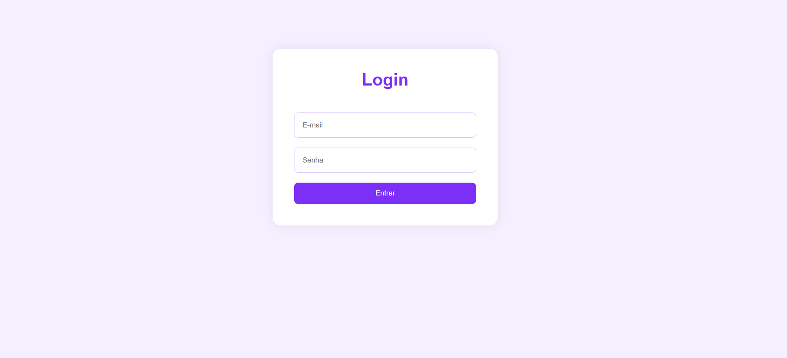
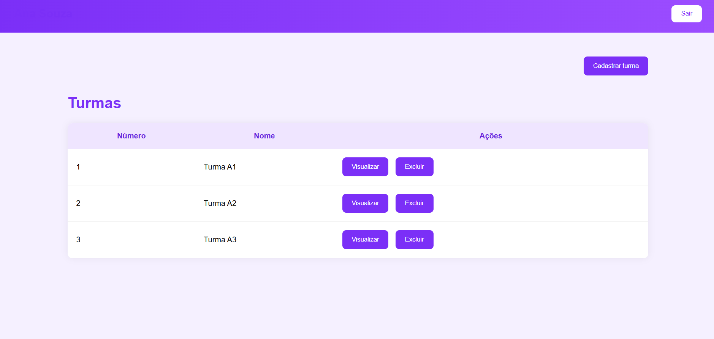
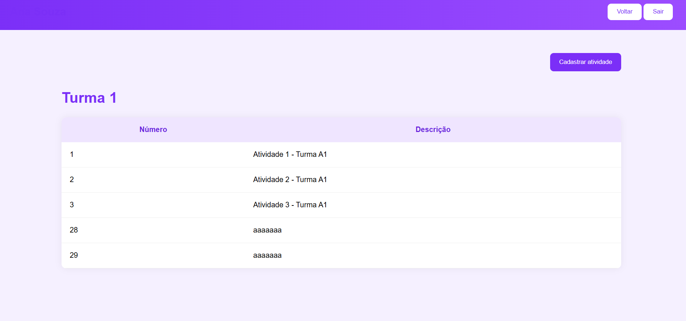

# Sistema de Controle de Turmas
Sistema Web para gerenciamento de turmas e atividades de professores.
Permite autenticar professores, cadastrar turmas, visualizar atividades e gerenciar conteúdos aplicados de forma prática e organizada.

## Ambiente de Desenvolvimento

- IDE utilizada: Visual Studio Code (VS Code)

## Servidor de Aplicação

- Node.js v22

## Banco de Dados

- SGBD: MySQL (XAMPP)

## Tecnologias

- HTML5
- CSS3
- JavaScript (ES6+)
- Node.js
- Express
- Prisma
- MySQL

| Funcionalidade | Tecnologia |
|:-|:-:|
| Estrutura da Interface | HTML5 |
| Estilização | CSS3 |
| Manipulação da Página | JavaScript |
| Requisições HTTP | Fetch API |
| Backend | Node.js + Express |
| Banco de Dados | MySQL |
| ORM | Prisma |
| Integração Front-End e Back-End | API REST |
| Navegação entre Telas | JavaScript |
| Armazenamento Temporário | LocalStorage |
| Exclusão de Registros | Método DELETE |


|  |  |  |
|:-:|:-:|:-:|
| Tela de Login | Tela Principal | Tela de Atividades |


# Funcionalidades

- Autenticação de professor
- Logout do sistema
- Cadastro de turmas
- Listagem de turmas por professor
- Exclusão de turmas
- Bloqueio de exclusão quando houver atividades cadastradas
- Visualização de atividades por turma
- Cadastro de atividades
- Navegação entre telas

# Estrutura do Projeto

```text
Frontend(web)
├── login.html
├── principal.html
├── atividades.html
├── css
│   └── style.css
└── js
    ├── login.js
    ├── principal.js
    └── atividade.js


Backend(api)
├── server.js
├── src
│   ├── controllers
│   ├── routes
│   └── data
└── prisma
````

# Para testar

* 1 Clone o repositório

```bash
git clone URL_DO_REPOSITORIO
```

* 2 Abra o projeto no VS Code

* 3 Instale as dependências do backend

```bash
npm install
```

* 4 Execute o servidor

```bash
node server.js
```

ou

```bash
npm start
```

* 5 Verifique se a API está rodando em:

```text
http://localhost:3000
```

* 6 Abra o arquivo **login.html** no navegador

* 7 Faça login utilizando um professor cadastrado

* 8 Cadastre turmas, visualize atividades e gerencie os registros

# Regras de Negócio

* O professor visualiza apenas suas próprias turmas
* Uma turma pertence somente a um professor
* Uma turma pode possuir várias atividades
* Uma atividade pertence somente a uma turma
* Não é permitido excluir uma turma que possua atividades cadastradas
* Ao sair do sistema o usuário retorna para a tela de login

# Autora

Pietra Vitória Fernandes Lopes

Projeto desenvolvido para fins acadêmicos.
